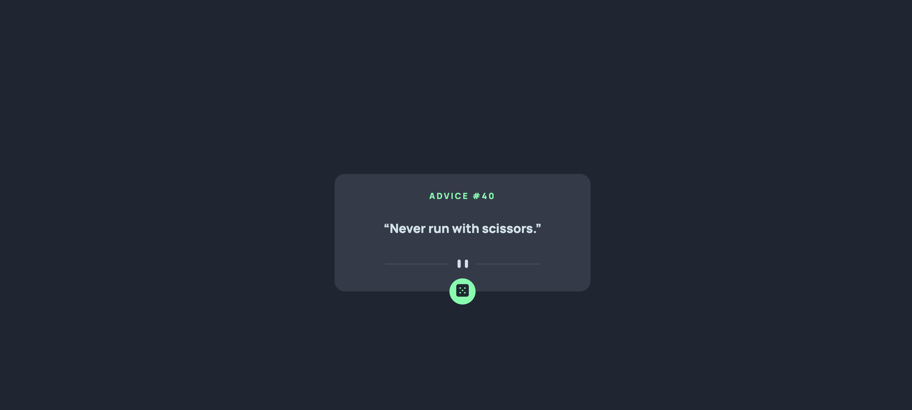

# Frontend Mentor - Advice generator app solution

This is a solution to the [Advice generator app challenge on Frontend Mentor](https://www.frontendmentor.io/challenges/advice-generator-app-QdUG-13db). Frontend Mentor challenges help you improve your coding skills by building realistic projects.

## Table of contents

- [Overview](#overview)
  - [The challenge](#the-challenge)
  - [Screenshot](#screenshot)
  - [Links](#links)
  - [Built with](#built-with)
  - [What I learned](#what-i-learned)
  - [Continued development](#continued-development)
- [Author](#author)


## Overview

### The challenge

Users should be able to:

- View the optimal layout for the app depending on their device's screen size
- See hover states for all interactive elements on the page
- Generate a new piece of advice by clicking the dice icon

### Screenshot



### Links

- Solution URL: [https://github.com/i-am-ashwin/frontendmentor-advicegenerator](https://github.com/i-am-ashwin/frontendmentor-advicegenerator)
- Live Site URL: [https://frontendmentor-advicegenerator.vercel.app/](https://frontendmentor-advicegenerator.vercel.app/)


### Built with

- Semantic HTML5 markup
- CSS custom properties
- Flexbox
- Mobile-first workflow
- [SVELTE](https://svelte.dev/) - JS library


### What I learned

Svelte makes it super easy to create smooth animation without any third party library
```html
{#key variable}
      <p in:fade >{variable}</p>
    {/key}
}
```

### Continued development

Svelte looks really interesting and simple I would look more into it.
## Author

- Website - [Aswin Harikumar](https://iamaswin.dev)
- Frontend Mentor - [@i-am-ashwin](https://www.frontendmentor.io/profile/i-am-ashwin)
- Twitter - [@suspicious_usr](https://www.twitter.com/suspicious_usr)
